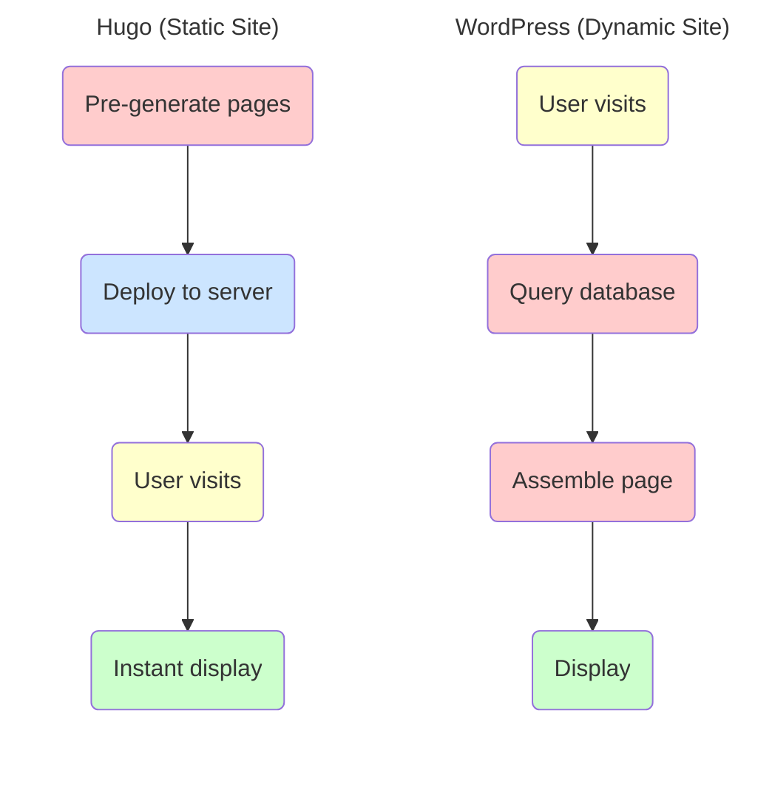
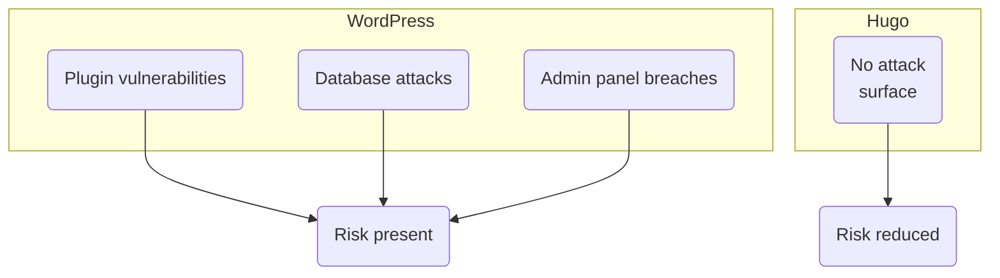

"We have a website, but it's not driving leads." "Our web advertising ROI has hit a ceiling." These are common challenges faced by many small businesses.

In recent years, "content marketing" has emerged as a powerful way to turn your website into a lead generation tool. By publishing helpful blog posts and informative content, you can increase organic traffic from search engines. Hugo is a website building tool that works exceptionally well for content marketing.

Sites built with Hugo load incredibly fast, which helps them rank better on search engines like Google. In this article, we'll explain what Hugo is and explore its advantages and disadvantages in plain terms.

## Static Sites vs Dynamic Sites

### Two Types of Websites

Websites fall into two categories: "dynamic sites" and "static sites." Hugo is a tool for building static sites.

WordPress is the most common example of a dynamic site. Every time someone visits a page, the server assembles and displays the page on the fly. While this offers flexibility, it puts more load on the server and creates potential security vulnerabilities.

Static sites display pre-built pages as-is. Think of it like manufacturing: a dynamic site is "made-to-order production" where products are assembled after receiving an order, while a static site is "inventory-based sales" where finished products are shipped from a warehouse. The inventory approach means faster delivery and less strain on the production line.

**Figure 1: How Static and Dynamic Sites Work**

### Characteristics of Static Sites

Static sites require you to regenerate files and upload them to the server whenever content changes. This makes them better suited for company profiles and service pages rather than news sites that need real-time updates.

On the other hand, static sites offer benefits like faster loading speeds, lower security risks, and reduced operating costs.

## What is Hugo?

### One of the World's Fastest Static Site Generators

In a nutshell, Hugo is "one of the world's fastest static site generators." Released in 2013 as free open-source software, it has earned over 86,000 "stars" (endorsements) on GitHub.

Hugo's main features include:

**Blazing Fast Build Speed**
Built with Go (Golang), Hugo can generate sites with thousands of pages in just seconds. This speed is a major advantage for sites that frequently add or update content.

**Simple Operations**
No database or server-side languages (like PHP) required. Hugo converts Markdown text files to HTML for publishing, which means lower security risks and easier management.

**High Flexibility**
Hundreds of free themes are available on the official site, supporting everything from blogs to corporate sites to documentation portals.

### Proven Track Record

Hugo powers over 150,000 websites worldwide (according to BuiltWith). Notable adopters include "Smashing Magazine," a leading web development publication, and "Cloudflare," a major internet infrastructure company, both achieving improved loading speeds and operational efficiency.

## Benefits of Hugo

### Benefit 1: Fast Loading Speeds for Better SEO

Sites built with Hugo often load several times faster than WordPress sites.

Loading speed directly impacts SEO (Search Engine Optimization). Since 2021, Google has included page speed as a ranking factor, putting slower sites at a disadvantage in search results. Research also shows that about half of visitors leave if a page takes more than 3 seconds to load.

With a Hugo-built site, you can prevent these lost opportunities and improve your search-driven traffic.

| Factor | Hugo | WordPress |
|:---|:---|:---|
| Page Load Time | 0.1-0.5 seconds | 1-3 seconds |
| Time to Generate 1000 Pages | ~2 seconds | — |
| Server Load | Light | Heavy |
| During Traffic Spikes | Stable | Tends to slow down |

**Table 1: Loading Speed Comparison**

### Benefit 2: Lower Security Risks

WordPress regularly faces security issues, from plugin vulnerabilities to database attacks.

Hugo-built sites have no database and no server-side programs running. Since there are no "entry points" for attackers to target, the risk of unauthorized access is dramatically reduced. For small businesses without dedicated security staff, this provides significant peace of mind.

**Figure 2: Security Risk Comparison**

### Benefit 3: Lower Operating Costs

Hugo sites can significantly reduce operating expenses.

Server costs for WordPress typically run $30-100/month, while Hugo sites can operate for $0-10/month since they don't require high-performance servers.

Maintenance costs are also lower. WordPress requires regular updates to its core and plugins, but Hugo has virtually no such requirements.

| Cost Item | WordPress | Hugo |
|:---|:---|:---|
| Server (monthly) | $30-100 | $0-10 |
| Maintenance (monthly) | $100-300 | Minimal |
| Annual Operating Cost | $1,500-5,000 | $0-500 |

**Table 2: Operating Cost Comparison (Estimates)**

### Benefit 4: Speed Doesn't Degrade as Content Grows

With WordPress, adding more posts increases database queries, which can slow down page loading.

Hugo doesn't use a database, so loading speed remains virtually unchanged whether you have 100 or 1,000 articles. This is a major advantage for businesses that want to continuously publish content to improve SEO.

## Drawbacks and Considerations

### Drawback 1: Technical Knowledge Required

Hugo doesn't have a visual admin panel like WordPress. Updating your site involves editing text files and running commands.

This isn't a problem for those comfortable with computers, but it may feel like a high barrier for others. Additionally, official documentation is primarily in English, and resources aren't as abundant as WordPress.

### Drawback 2: Contact Forms Require Additional Setup

Since Hugo creates static sites, dynamic features like contact forms and member registration aren't available by default.

However, you can embed Google Forms or dedicated form services to add this functionality. Many businesses successfully operate this way.

### Drawback 3: Not Suited for Real-Time Updates

Hugo requires regenerating and uploading the site whenever content changes. This works fine for once-daily updates, but isn't ideal for sites that need multiple real-time updates per day.

For typical business sites—company profiles, service pages, blogs—Hugo handles the job perfectly well.

| Consideration | Hugo is Good For | Hugo is Not Good For |
|:---|:---|:---|
| Update Frequency | Up to once daily | Real-time updates needed |
| Site Type | Company profiles, service pages, blogs | E-commerce, membership sites |
| Required Features | Information publishing | Payment, login functionality |

**Table 3: When Hugo Works (and When It Doesn't)**

## Getting Started with Hugo

Here's the basic workflow for publishing a site with Hugo:

**Figure 3: Hugo Implementation Flow**

Hugo is operated via command line. Download and install from the official site, run commands to create a site scaffold, apply a design theme, add content and generate the site, then upload to your server for publishing.

Hundreds of design themes are available free on the official site, letting you choose one that fits your purpose. For hosting, you can use standard web hosting or services like GitHub Pages, Netlify, or AWS Amplify.

## Comparing Hugo and WordPress

WordPress is the world's most widely used CMS (Content Management System), powering about 43% of all websites—over 34 million sites (according to BuiltWith). Its intuitive admin interface and plugin-based extensibility make it appealing.

However, it requires regular updates and security measures, adding to operating costs. There's also risk of server downtime during traffic spikes.

Hugo addresses these challenges, but lacks an admin panel, requiring some learning curve. It's not about which is better—it's about choosing what fits your site's purpose and operational capabilities.

| Comparison | Hugo | WordPress |
|:---|:---|:---|
| Loading Speed | Very fast | Average to slow |
| Security | High | Requires measures |
| Operating Cost | Low | Medium to high |
| Ease of Use | Learning curve | Intuitive |
| Extensibility | External service integration | Plugins |

**Table 4: Hugo vs WordPress Comparison**

For a more detailed comparison of Hugo and WordPress, see "[Hugo vs WordPress: A Comprehensive Comparison](/en/blog/hugo-vs-wordpress-comparison/)."

## Content Marketing and Hugo

### Increasing Search Traffic

To drive more traffic to your website, "content marketing"—continuously publishing helpful information and blog posts—is highly effective. Ranking high in search results lets you attract potential customers without advertising costs.

Hugo is an excellent tool for content marketing. Its fast loading speeds benefit SEO, and performance doesn't degrade as you add more content, making it ideal for ongoing content publishing.

### The Challenge: Content Creation Effort

However, continuously creating high-quality content isn't easy. A single article can take several hours to produce, and finding time for content creation while running your core business is a real challenge.

## SmartWeb Services

### Hugo Fast Web Development

SmartWeb offers website development services using Hugo.

We handle all the technical aspects, so you can have a fast, secure Hugo site without knowing command-line operations or server configuration. We build sites with SEO in mind and structures that make adding content easy—all designed with lead generation in focus.

### AI Content Creation

SmartWeb also offers AI-powered content creation services.

Multiple AI systems work together to automatically generate SEO-optimized article drafts, dramatically reducing content creation time. Of course, AI creates drafts, and human review ensures final quality.

In fact, SmartWeb's own site uses this method to create over 1,200 technical term explanations, leveraging them for search engine traffic.

### Hugo Sites × AI Content: The Winning Combination

Build a fast site with Hugo, then continuously add efficiently-created AI content. This combination enables small businesses to execute serious content marketing.

- [Hugo Fast Web Development](/en/services/hugo-web/)
- [AI Content Creation](/en/services/ai-content/)

## Summary

Hugo is a compelling choice for small businesses building marketing-focused websites.

**Benefits of Hugo**
- Fast loading speeds benefit SEO
- Lower security risks
- Reduced operating costs
- Speed doesn't degrade as content grows

**Considerations**
- Technical knowledge required for setup and operation
- Contact forms require additional setup
- Not suited for real-time updates

If implementing Hugo on your own seems challenging, services like SmartWeb can help. If you're looking to turn your website into a lead generation tool, consider exploring Hugo.

## References

- Hugo Official Site: https://gohugo.io/
- Hugo Themes: https://themes.gohugo.io/
- SmartWeb Hugo Fast Web Development: https://smartweb.jp/en/services/hugo-web/
- SmartWeb AI Content Creation: https://smartweb.jp/en/services/ai-content/
