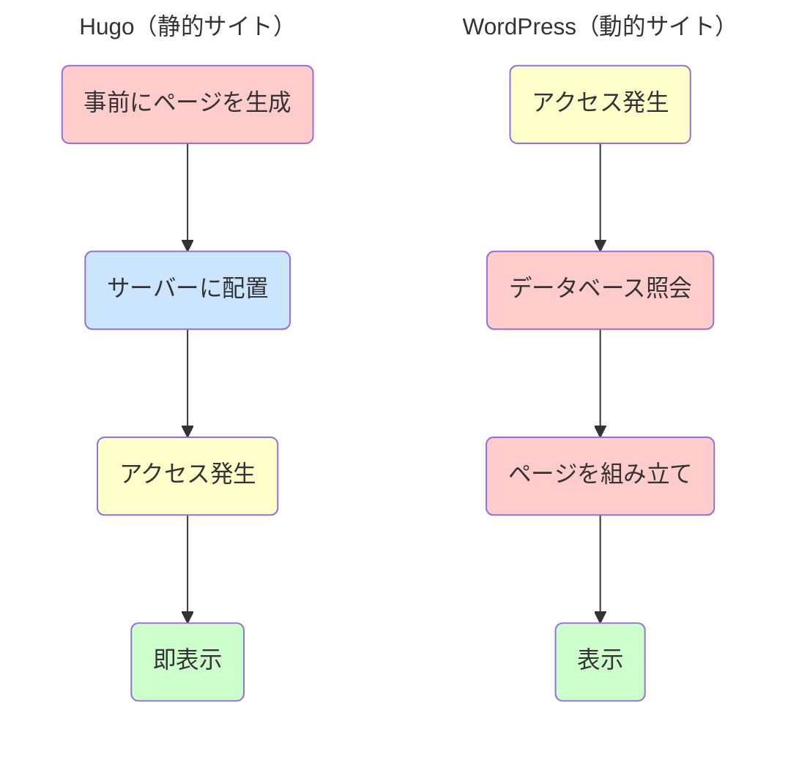
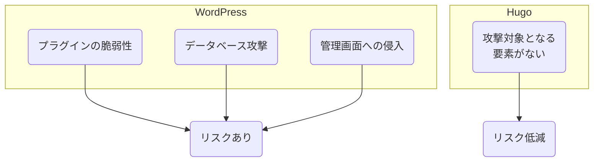

「ホームページはあるけれど、なかなか集客につながらない」「Web広告の費用対効果に限界を感じている」——こうした課題を持つ中小企業は少なくありません。

近年、自社サイトを集客の武器に変える方法として「コンテンツマーケティング」が注目されています。ブログ記事やお役立ち情報を充実させることで、検索エンジンからの流入を増やす手法です。そして、このコンテンツマーケティングと相性が良いのが「Hugo（ヒューゴ）」というホームページ制作ツールです。

Hugoで作ったサイトは表示速度が速く、Googleなどの検索エンジンに評価されやすいという特徴があります。この記事では、Hugoとは何か、どんなメリット・デメリットがあるのかを、わかりやすく解説します。

## 静的サイトと動的サイトの違い

### 2種類のホームページ

ホームページには「動的サイト」と「静的サイト」の2種類があります。Hugoは「静的サイト」を作るためのツールです。

動的サイトの代表例はWordPressです。誰かがページを見に来るたびに、サーバーがその場でページを組み立てて表示します。柔軟性が高い反面、サーバーに負荷がかかりやすく、セキュリティ面での弱点も生まれやすいという特徴があります。

静的サイトは、あらかじめ完成したページをそのまま表示する仕組みです。製造業にたとえるなら、動的サイトは「注文を受けてから製品を組み立てる受注生産」、静的サイトは「完成品を倉庫から出荷する在庫販売」のようなものです。在庫方式なら納品が速く、生産ラインの負荷も抑えられます。

**図1：静的サイトと動的サイトの仕組み**

### 静的サイトの特徴

静的サイトは、ページの内容を変更するたびにファイルを作り直してサーバーにアップロードする必要があります。そのため、リアルタイムで頻繁に更新するニュースサイトよりも、会社案内やサービス紹介のようなサイトに向いています。

一方で、表示速度が速い、セキュリティリスクが低い、運用コストを抑えられるといったメリットがあります。

## Hugoとは

### 世界最速級の静的サイト作成ツール

Hugoをひと言で表すと、「世界最速級の静的サイトジェネレーター」です。2013年に公開された無料のオープンソースソフトウェアで、GitHubでは86,000以上の「スター」（支持の印）を獲得しています。

Hugoの主な特徴は以下の3点です。

**圧倒的なビルド速度**
HugoはGo言語（Golang）で開発されており、数千ページのサイトでもわずか数秒で生成できるほどの処理能力を誇ります。コンテンツを頻繁に追加・更新するサイト運営において、この速さは大きなメリットです。

**運用がシンプル**
データベースやサーバーサイドの言語（PHPなど）を必要としません。Markdown形式のテキストファイルをHTMLへ変換して公開するため、セキュリティリスクが低く、管理も容易です。

**高い柔軟性**
公式サイトで数百種類の無料テーマが提供されており、ブログから企業サイト、ドキュメントサイトまで幅広く対応できます。

### 採用企業の実績

Hugoは世界中で15万以上のWebサイトで稼働しています（BuiltWith調べ）。Web制作の専門メディア「Smashing Magazine」や、インターネットインフラ大手の「Cloudflare」もHugoを採用し、表示速度の向上と運用効率の改善を実現しています。

## Hugoのメリット

### メリット①：表示速度が速く、SEOに有利

Hugoで作ったサイトは、WordPressと比較して数倍速く表示されることも珍しくありません。

表示速度はSEO（検索エンジン最適化）に直接影響します。Googleは2021年から表示速度を検索順位の評価基準に組み込んでおり、表示の遅いサイトは検索結果で不利になります。また、ページの読み込みに3秒以上かかると、約半数の訪問者が離脱するというデータもあります。

Hugoで構築したサイトなら、こうした機会損失を防ぎ、検索からの集客力を高められます。

| 項目 | Hugo | WordPress |
|:---|:---|:---|
| ページ表示速度 | 0.1〜0.5秒 | 1〜3秒 |
| 1000ページの生成時間 | 約2秒 | — |
| サーバー負荷 | 軽い | 重い |
| アクセス集中時 | 安定 | 遅くなりやすい |

**表1：表示速度の比較**

### メリット②：セキュリティリスクが低い

WordPressでは、プラグインの脆弱性やデータベースへの攻撃など、セキュリティ上の問題が定期的に報告されています。

Hugoで作ったサイトには、データベースもサーバー側で動作するプログラムもありません。攻撃者が狙う「入り口」がそもそも存在しないため、不正アクセスのリスクを大幅に減らせます。専任のセキュリティ担当者がいない中小企業にとって、これは大きな安心材料です。

**図2：セキュリティリスクの比較**

### メリット③：運用コストを抑えられる

Hugoサイトは、運用にかかる費用を大幅に削減できます。

サーバー代は、WordPressが月額3,000〜10,000円程度かかるのに対し、Hugoなら無料〜1,000円程度で済みます。高性能なサーバーが不要なためです。

保守管理費も抑えられます。WordPressは本体やプラグインの定期的なアップデートが必要ですが、Hugoにはそうした作業がほとんどありません。

| 費用項目 | WordPress | Hugo |
|:---|:---|:---|
| サーバー代（月額） | 3,000〜10,000円 | 0〜1,000円 |
| 保守管理費（月額） | 10,000〜30,000円 | ほぼ不要 |
| 年間運用コスト目安 | 15〜50万円 | 0〜5万円 |

**表2：運用コストの比較（目安）**

### メリット④：コンテンツを増やしても速度が落ちない

WordPressでは、記事が増えるとデータベースへの問い合わせが増え、表示速度が低下することがあります。

Hugoはデータベースを使わないため、100記事でも1,000記事でも表示速度はほぼ変わりません。継続的にコンテンツを発信してSEO効果を高めたい企業にとって、これは大きなメリットです。

## Hugoのデメリットと注意点

### デメリット①：導入・操作に技術的な知識が必要

HugoにはWordPressのような管理画面がありません。サイトの更新は、テキストファイルを編集してコマンドを実行するという手順になります。

パソコン操作に慣れている方なら問題ありませんが、そうでない場合は最初のハードルが高く感じられるかもしれません。また、公式ドキュメントは英語が中心で、日本語の情報はWordPressほど充実していません。

### デメリット②：お問い合わせフォームなどは別途対応が必要

Hugoは静的サイトのため、お問い合わせフォームや会員登録といった動的機能は標準では使えません。

ただし、Googleフォームや専用のフォームサービスを埋め込むことで対応できます。実際、多くの企業がこの方法で運用しています。

### デメリット③：リアルタイム更新には向かない

Hugoは内容を変更するたびにサイトを再生成してアップロードする必要があります。1日1回程度の更新であれば問題ありませんが、1日に何度もリアルタイムで更新するようなサイトには向きません。

会社案内、サービス紹介、ブログなど、一般的な企業サイトであれば十分に対応できます。

| 観点 | Hugoが向いている | Hugoが向いていない |
|:---|:---|:---|
| 更新頻度 | 1日1回程度まで | リアルタイム更新が必要 |
| サイトの種類 | 会社案内、サービス紹介、ブログ | ECサイト、会員制サイト |
| 必要な機能 | 情報発信が中心 | 決済、ログイン機能 |

**表3：Hugoの向き・不向き**

## Hugoの導入の流れ

Hugoでサイトを公開するまでの基本的な流れは以下のとおりです。

**図3：Hugo導入の流れ**

Hugoはコマンドラインで操作します。公式サイトからダウンロードしてインストールし、コマンドを実行してサイトのひな型を作成、デザインテーマを適用、コンテンツを追加してサイトを生成、最後にサーバーにアップロードして公開という流れです。

デザインテーマは公式サイトで数百種類が無料で公開されており、目的に合ったものを選べます。サーバーは通常のレンタルサーバーのほか、GitHub PagesやNetlify、AWS Amplifyといったホスティングサービスも利用できます。

## WordPressとの比較

WordPressは世界で最も使われているCMS（コンテンツ管理システム）で、全Webサイトの約43%、3,400万サイト以上で採用されています（BuiltWith調べ）。管理画面から直感的に操作でき、プラグインで機能を追加できる柔軟性が魅力です。

一方で、定期的なアップデートやセキュリティ対策が必要で、運用コストがかかります。また、アクセスが集中したときにサーバーがダウンするリスクもあります。

Hugoはこうした課題を解決できる選択肢ですが、管理画面がないため操作には慣れが必要です。どちらが良い・悪いではなく、サイトの目的や運用体制に合わせて選ぶことが大切です。

| 比較項目 | Hugo | WordPress |
|:---|:---|:---|
| 表示速度 | 非常に速い | 普通〜遅い |
| セキュリティ | 高い | 対策が必要 |
| 運用コスト | 低い | 中〜高 |
| 操作のしやすさ | 慣れが必要 | 直感的 |
| 機能拡張 | 外部サービス連携 | プラグイン |

**表4：HugoとWordPressの比較**

HugoとWordPressの違いについて、より詳しく知りたい方は「[HugoとWordPressの違いを徹底比較](/ja/blog/hugo-vs-wordpress-comparison/)」もご覧ください。

## コンテンツマーケティングとHugo

### 検索からの集客を増やすには

自社サイトへの集客を増やすには、お役立ち情報やブログ記事を継続的に発信する「コンテンツマーケティング」が効果的です。検索エンジンで上位表示されれば、広告費をかけずに見込み客を集められます。

Hugoはこのコンテンツマーケティングと相性が良いツールです。表示速度が速くSEOに有利なこと、記事を増やしても速度が落ちないことから、継続的なコンテンツ発信に適しています。

### 課題は「コンテンツ制作の手間」

ただし、質の高いコンテンツを継続的に作り続けるのは簡単ではありません。1本の記事を作成するのに数時間かかることも多く、本業が忙しい中でコンテンツ制作に時間を割くのは難しいのが現実です。

## SmartWebのサービス紹介

### Hugo高速Web構築

SmartWebでは、Hugoを活用したWebサイト構築サービスを提供しています。

技術的な部分はSmartWebが担当するため、コマンドライン操作やサーバー設定の知識がなくても、Hugoの高速・高セキュリティなサイトを持つことができます。SEOを意識した設計、コンテンツを追加しやすい構造など、集客を見据えたサイト構築を行います。

### AIコンテンツ作成

SmartWebでは、AIを活用したコンテンツ作成サービスも提供しています。

複数のAIが連携してSEO最適化された記事の下書きを自動生成し、記事作成時間を大幅に短縮できます。もちろん、AIが作るのは下書きで、最終的な品質は人間のチェックで担保します。

実際にSmartWebのサイトでは、この方法で1,200以上の専門用語解説を作成し、検索エンジンからの集客に活用しています。

### Hugoサイト × AIコンテンツの組み合わせ

Hugoで構築した高速サイトに、AIで効率的に作成したコンテンツを継続的に追加していく。この組み合わせで、中小企業でも本格的なコンテンツマーケティングを実現できます。

- [Hugo高速Web構築](/ja/services/hugo-web/)
- [AIコンテンツ作成](/ja/services/ai-content/)

## まとめ

Hugoは、中小企業がマーケティングに活用できるWebサイトを構築する際の有力な選択肢です。

**Hugoのメリット**
- 表示速度が速く、SEOに有利
- セキュリティリスクが低い
- 運用コストを抑えられる
- コンテンツを増やしても速度が落ちない

**注意点**
- 導入・操作に技術的な知識が必要
- お問い合わせフォームなどは別途対応
- リアルタイム更新には向かない

自社だけでの導入が難しい場合は、SmartWebのようなサービスを活用する方法もあります。自社サイトを集客の武器に変えたいとお考えの方は、ぜひHugoの活用を検討してみてください。

## 参考情報

- Hugo公式サイト: https://gohugo.io/
- Hugo Themes: https://themes.gohugo.io/
- SmartWeb Hugo高速Web構築: https://smartweb.jp/ja/services/hugo-web/
- SmartWeb AIコンテンツ作成: https://smartweb.jp/ja/services/ai-content/
