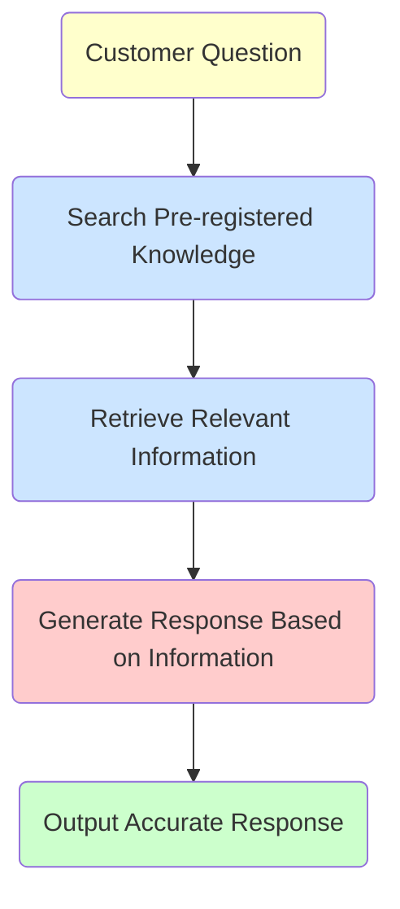

**RAG (Retrieval-Augmented Generation)** is the core technology that enables SmartWeb's AI chatbots and AI email response creation to generate high-precision responses.

## What is RAG?

### Problems with Traditional AI

Traditional Large Language Models (LLMs) had the following issues:

| Problem | Description |
|---------|-------------|
| **Hallucinations** | Fabricating information that seems plausible but doesn't exist in training data |
| **Outdated Information** | Only possessing information from the training period, unable to handle latest information |
| **Lack of Specific Information** | Not knowing information specific to your company's products and services |

### Solution through RAG

RAG solves these problems by combining **"retrieval"** and **"generation"**.

The key point is **pre-registering and indexing knowledge**. When AI receives a question, it searches for relevant information within this pre-registered knowledge and generates responses based on that information. It does not search websites in real-time.

**Figure: RAG Processing Flow** (Yellow: Input, Blue: Retrieval Phase, Pink: Generation Phase, Green: Output)

**Note**: "Search" refers to searching within knowledge sources pre-registered in FlowHunt, not internet search.

## How RAG Works

### Step 1: Understanding the Question

When a customer inputs a question, the AI analyzes the question's intent and extracts keywords and concepts suitable for search.

### Step 2: Searching Pre-registered Knowledge (Retrieval)

Searches for information related to the question from **pre-registered and indexed** FlowHunt knowledge sources (Schedules, Q&A, Documents).

**Important**: This search does not search websites or external documents on the internet in real-time. It only searches within knowledge pre-registered in FlowHunt.

- **Vector Search**: High-speed search for semantically similar content
- **Keyword Search**: Search by specific terms or product names
- **Hybrid Search**: High-precision search combining both approaches

### Step 3: Context Construction

Organizes the relevant information found through search and constructs the context necessary for response generation.

### Step 4: Response Generation (Generation)

The LLM generates natural and accurate responses based on the search results.

**Important**: Since the LLM responds based on "search results" rather than "its own knowledge," hallucinations are significantly reduced.

## Benefits of RAG

### 1. Prevention of Hallucinations

| Traditional AI | RAG-equipped AI |
|----------------|-----------------|
| Responds by inferring from training data | Responds based on search results |
| May generate non-existent information | Responds "I don't know" when information isn't in knowledge base |
| Unclear basis for responses | Can identify response sources |

### 2. Support for Latest Information

By updating the knowledge base, AI responses are immediately updated. No need for LLM retraining.

### 3. Support for Company-specific Information

By registering product manuals, FAQs, internal documents, etc., in the knowledge base, it can accurately respond to company-specific questions.

### 4. Cost Efficiency

Compared to LLM fine-tuning (additional training), RAG is efficient in the following aspects:

| Item | Fine-tuning | RAG |
|------|-------------|-----|
| Information Updates | Requires retraining | Knowledge update only |
| Cost | High | Low |
| Reflection Speed | Days to weeks | Immediate |
| Expertise Required | Yes | No |

## RAG Utilization in SmartWeb

### Supported Features

| Feature | RAG | Description |
|---------|:---:|-------------|
| AI Chatbot | ✓ | Uses RAG for automated customer responses |
| AI Email Response Creation (Composer) | ✓ | Uses RAG for generating email reply drafts |
| AI Response Assist (Improver) | - | Text improvement only (no search) |

### Importance of Knowledge Sources

Since RAG searches from "pre-registered knowledge," it **cannot respond to information that hasn't been registered**. Therefore, RAG accuracy heavily depends on **knowledge base quality**:

- **Comprehensiveness**: Does it cover all frequently asked questions?
- **Accuracy**: Is the information accurate and up-to-date?
- **Clarity**: Are the texts clear and easily understood by AI?

For details, see "[How AI Learns](/en/support/ai-fundamentals/ai-learning/)".

## RAG Limitations and Countermeasures

### Limitation 1: Questions about Unregistered Information

Since RAG searches from pre-registered knowledge, it **cannot respond to information that hasn't been registered**. It cannot retrieve external information on the spot like internet search.

**Countermeasures**: 
- Set fallback responses like "Please contact us through the inquiry form"
- Utilize escalation features to human operators

### Limitation 2: Impact of Search Accuracy

Response quality degrades when appropriate information cannot be found through search.

**Countermeasures**:
- Optimize knowledge base structure
- Create content considering synonyms and similar terms
- Cover important question patterns comprehensively in Q&A

### Limitation 3: Complex Reasoning

Complex reasoning combining multiple pieces of information is challenging.

**Countermeasures**:
- Escalate complex questions to human operators
- Pre-register anticipated question patterns in Q&A

## Summary

Through RAG technology, SmartWeb's AI achieves the following:

| Feature | Effect |
|---------|--------|
| **High Precision** | Accurate responses based on knowledge |
| **Timeliness** | Immediate reflection through knowledge updates |
| **Customization** | Support for company-specific information |
| **Reliability** | Significant reduction in hallucinations |

To maximize RAG effectiveness, knowledge base quality management is important. We recommend regular content review and updates.

## Related Information

- [How AI Learns](/en/support/ai-fundamentals/ai-learning/) - Knowledge source setup and optimization
- [About FlowHunt](/en/support/ai-fundamentals/flowhunt-about/) - The platform that enables RAG
- [AI Chatbot Response Accuracy](/en/support/ai-chatbot/ai-answer-accuracy/) - Key points for improving accuracy
