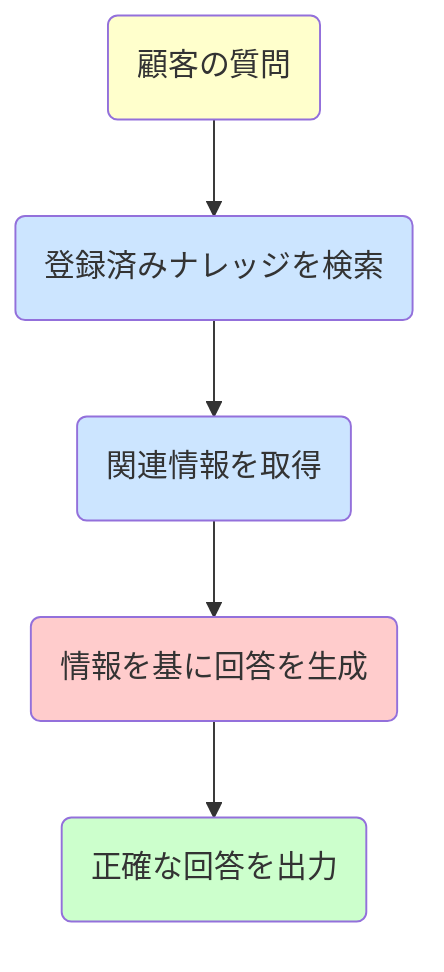

**RAG（Retrieval-Augmented Generation：検索拡張生成）**&#8203;は、SmartWebのAIチャットボットとAIメール回答作成が高精度な回答を生成するための核心技術です。

## RAGとは何か

### 従来のAIの問題点

従来の大規模言語モデル（LLM）には以下の問題がありました：

| 問題 | 説明 |
|------|------|
| **ハルシネーション** | 学習データにない情報を「それらしく」捏造してしまう |
| **情報の古さ** | 学習時点の情報しか持たず、最新情報に対応できない |
| **固有情報の欠如** | 御社の製品・サービス固有の情報を知らない |

### RAGによる解決

RAGは「**検索**」と「**&#8203;生成**」を組み合わせることで、これらの問題を解決します。

ポイントは、**事前にナレッジを登録・インデックス化**&#8203;しておくことです。AIは質問を受けると、この登録済みナレッジの中から関連情報を検索し、その情報を基に回答を生成します。リアルタイムでWebサイトを検索するわけではありません。

**図：RAGの処理フロー**（黄色：入力、青：検索フェーズ、ピンク：生成フェーズ、緑：出力）

**注意**: 「検索」とはインターネット検索ではなく、FlowHuntに事前登録されたナレッジソース内の検索です。

## RAGの仕組み

### Step 1: 質問の理解

顧客が質問を入力すると、AIは質問の意図を分析し、検索に適したキーワードやコンセプトを抽出します。

### Step 2: 登録済みナレッジの検索（Retrieval）

**事前に登録・インデックス化された**FlowHuntのナレッジソース（Schedules、Q&A、Documents）から、質問に関連する情報を検索します。

**重要**: この検索は、リアルタイムでインターネット上のWebサイトや外部ドキュメントを検索するわけではありません。あくまでFlowHuntに事前登録されたナレッジの中から検索します。

- **ベクトル検索**: 意味的に類似したコンテンツを高速に検索
- **キーワード検索**: 特定の用語や製品名で検索
- **ハイブリッド検索**: 両方を組み合わせた高精度検索

### Step 3: コンテキストの構築

検索で見つかった関連情報を整理し、回答生成に必要なコンテキストを構築します。

### Step 4: 回答の生成（Generation）

LLMが検索結果を基に、自然で正確な回答を生成します。

**重要**: LLMは「自分の知識」ではなく「検索結果」に基づいて回答するため、ハルシネーションが大幅に減少します。

## RAGのメリット

### 1. ハルシネーションの防止

| 従来のAI | RAG搭載AI |
|---------|----------|
| 学習データから推測して回答 | 検索結果に基づいて回答 |
| 存在しない情報を生成する可能性 | ナレッジにない場合は「わからない」と回答 |
| 回答の根拠が不明確 | 回答のソースを特定可能 |

### 2. 最新情報への対応

ナレッジベースを更新すれば、AIの回答も即座に更新されます。LLMの再学習は不要です。

### 3. 御社固有の情報に対応

製品マニュアル、FAQ、社内文書などをナレッジベースに登録することで、御社固有の質問にも正確に回答できます。

### 4. コスト効率

LLMのファインチューニング（追加学習）と比較して、RAGは以下の点で効率的です：

| 項目 | ファインチューニング | RAG |
|------|-------------------|-----|
| 情報更新 | 再学習が必要 | ナレッジ更新のみ |
| コスト | 高い | 低い |
| 反映速度 | 数日〜数週間 | 即時 |
| 専門知識 | 必要 | 不要 |

## SmartWebでのRAG活用

### 対応機能

| 機能 | RAG | 説明 |
|------|:---:|------|
| AIチャットボット | ✓ | 顧客への自動回答にRAGを使用 |
| AIメール回答作成（Composer） | ✓ | メール返信の下書き生成にRAGを使用 |
| AI回答アシスト（Improver） | - | 入力テキストの改善のみ（検索なし） |

### ナレッジソースの重要性

RAGは「事前に登録されたナレッジ」から検索する仕組みのため、**登録されていない情報には回答できません**。そのため、RAGの精度は**&#8203;ナレッジベースの品質**に大きく依存します：

- **網羅性**: よくある質問をすべてカバーしているか
- **正確性**: 情報が正確で最新か
- **明確性**: 文章が明確でAIが理解しやすいか

詳細は「[AIの学習方法](/ja/support/ai-fundamentals/ai-learning/)」をご覧ください。

## RAGの限界と対策

### 限界1: 登録されていない情報への質問

RAGは事前登録されたナレッジから検索するため、**登録されていない情報には回答できません**。インターネット検索のように、その場で外部情報を取得することはできません。

**対策**: 
- 「お問い合わせフォームからご連絡ください」などのフォールバック回答を設定
- 有人オペレーターへのエスカレーション機能を活用

### 限界2: 検索精度の影響

検索で適切な情報が見つからないと、回答品質が低下します。

**対策**:
- ナレッジベースの構成を最適化
- 同義語・類義語を考慮したコンテンツ作成
- Q&Aで重要な質問パターンを網羅

### 限界3: 複雑な推論

複数の情報を組み合わせた複雑な推論は苦手です。

**対策**:
- 複雑な質問は有人オペレーターにエスカレーション
- 想定される質問パターンをQ&Aに事前登録

## まとめ

RAG技術により、SmartWebのAIは以下を実現しています：

| 特徴 | 効果 |
|------|------|
| **高精度** | ナレッジに基づいた正確な回答 |
| **最新性** | ナレッジ更新で即座に反映 |
| **カスタマイズ** | 御社固有の情報に対応 |
| **信頼性** | ハルシネーションの大幅削減 |

RAGの効果を最大化するには、ナレッジベースの品質管理が重要です。定期的なコンテンツの見直しと更新をおすすめします。

## 関連情報

- [AIの学習方法](/ja/support/ai-fundamentals/ai-learning/) - ナレッジソースの設定と最適化
- [FlowHuntとは](/ja/support/ai-fundamentals/flowhunt-about/) - RAGを実現するプラットフォーム
- [AIチャットボットの回答精度](/ja/support/ai-chatbot/ai-answer-accuracy/) - 精度向上のポイント
